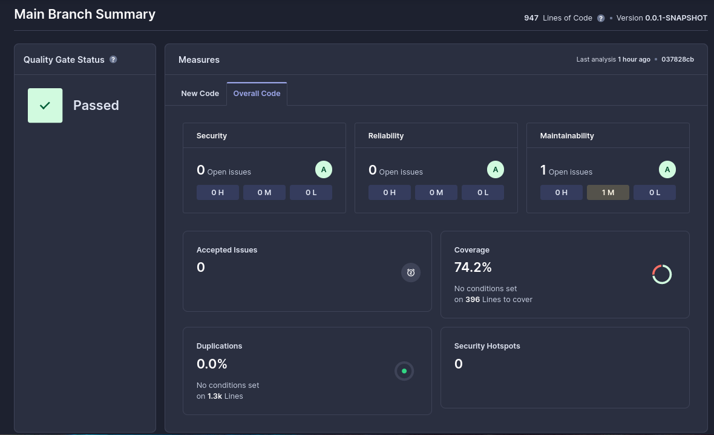
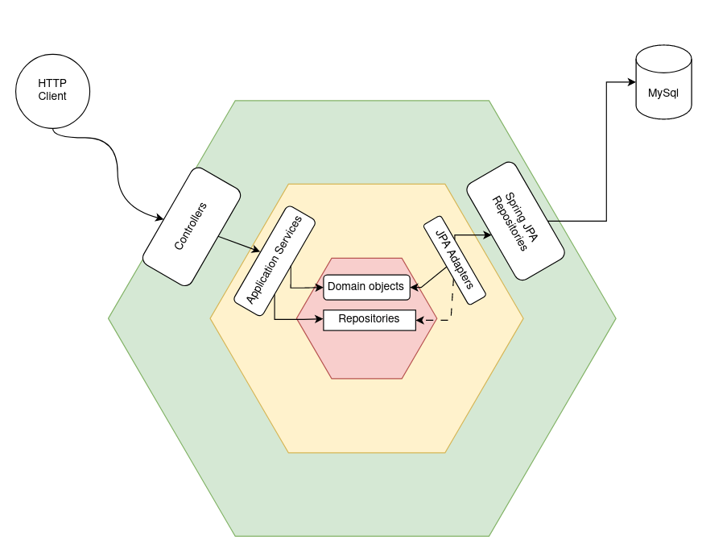
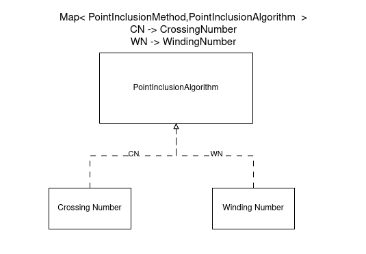
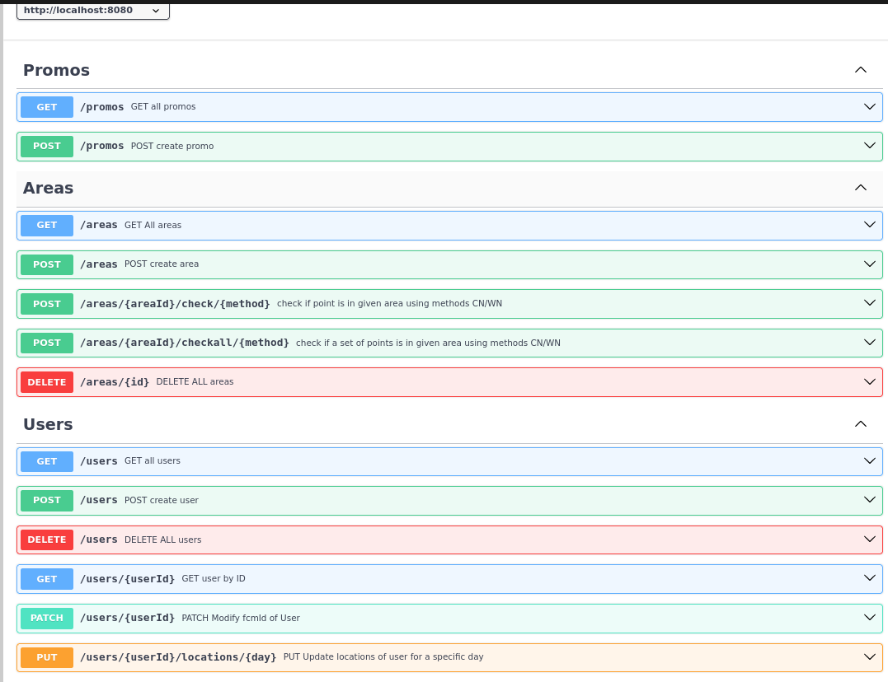
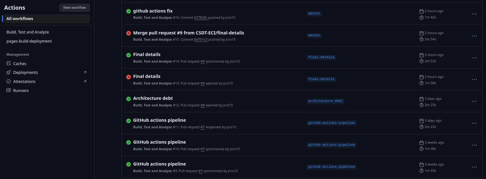
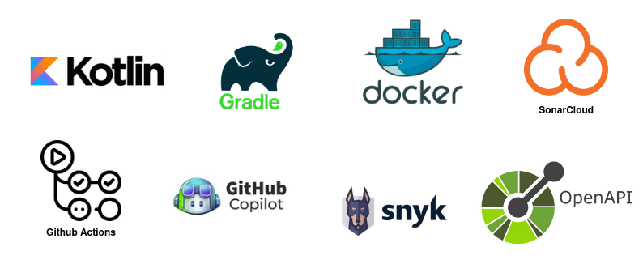

# CSDT : Proceso de gestión de deuda técnica de API Promo
Este documento presenta un resumen de la gestión de deuda técnica realizada en el proyecto API Promo, y corresponde
a la entrega final del proyecto de calidad de software y gestion de deuda técnica (CSDT). A continuación se presentan las distintas etapas de mejora realizadas en el proyecto:
## Contexto de la aplicación
API Promo es una API REST construida con el objetivo de probar los algoritmos geometría  winding number y crossing number,
que permiten determinar si un punto se encuentra dentro de un polígono. A partir de esto se plantean 3 recursos:
* Users: Recurso que representa a los usuarios de la aplicación, se pueden realizar operaciones CRUD sobre este recurso.
* Areas: Recurso que representa las áreas de la aplicación, se pueden realizar operaciones CRUD sobre este recurso ,
  y verificar si un punto o un conjunto de puntos se encuentran dentro de un área.
* Promos: Recurso que representa las promociones de la aplicación, permite creación y consulta, al momento de creación
  se toma un conjunto de áreas y verifica los usuarios que se encuentran dentro de estas áreas, para asignar la promoción.

## Estado inicial: Deuda técnica identificada
### Análisis inicial de Sonar a partir de primera versión ejecutable

### Más allá del análisis de Sonar
#### Bugs

#### Arquitectura

#### Otros
* Ausencia de documentación
* Uso de Java 8 , mezcla de archivos java y kotlin, librerías obsoletas y con vulnerabilidades
* Poca extensibilidad del código, dificultad para agregar nuevos algoritmos de detección de puntos en polígonos
* Mal diseño de endpoints REST

## Mejoras realizadas
### Análisis de sonar final

### Arquitectura obtenida

### Diseño de domino para algoritmos de geometría

### Documentación de endpoints y generación automática de contratos API

### Uso de pipelines de CI

### Stack utilizado
