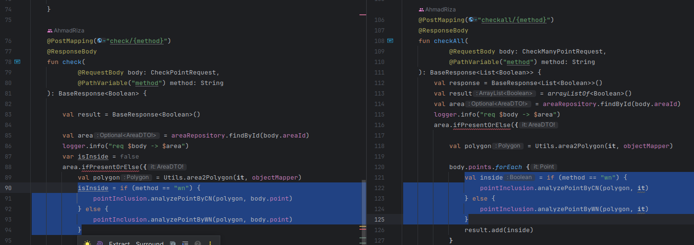

# Análisis de principios de Clean Code y prácticas XP
## Principios de Clean Code
### YAGNI (You Aren't Gonna Need It)
A partir del uso del IDE Intelij se detectan algunos métodos  y atributos en el código que no se están utilizando, por lo que el proyecto no cumple con este
principio, algunos ejemplos son  el atributo `polygons` y los métodos `findPolygonSurroundingByWN`,`findPolygonSurroundingByCN` y `setDataSet` de la clase `PointInclusion` y los métodos `getOuterRadius`,`degreeToMeter`,`measure` de la clase `PolygonUtils`

La sugerencia para cumplir con este principio es remover tanto los métodos como los atributos que no se estan utilizando.

### DRY (Dont Repeat Yourself)
Si bien la estructura actual del código dificulta la identificación de fragmentos repetidos, se puede identificar un
bloque de código repetido en la clase `AreaController`, correspondiente a lógica que permite determinar si un punto está
dentro de un poligono, los bloques repetidos se muestran a continuación: 

Esto se puede solucionar extrayendo el bloque de código repetido a un método nuevo, 

### KISS
Si bien el concepto de simplicidad puede ser complicado de determinar, considero que en la solución hay varios módulos que
cuentan con una complejidad innecesaria generada ya sea por el diseño utilizado, como por 
la forma de codificación que dificulta entender el código. A continuación se listan algunos ejemplos y potenciales soluciones:

* Clase `UserLocation`: Se utiliza para rastrear la ubicación de un usuario en distintos días, sin embargo se utiliza un atributo
 para cada día, este diseño se podría simplificar por medio de utilizar un atributo para la localización y otro para la fecha,
 de esta forma se puede almacenar más tiempo, y permite simplificar el código.
* Implementación de algoritmos  CROSSING NUMBER y  WINDING NUMBER en la clase `PointInclusion`, la codificación de los métodos pertenecientes a estos 
  algoritmos utiliza variables poco descriptivas y esto añade complejidad al entender el código.
* El uso de archivos tanto .kt, como .java añade complejidad innecesaria al proyecto, puesto que hay que mantener código en 
  dos lenguajes similares pero diferentes, adicionalmente las clases DTO (`PromoDTO`,`AreaDTO`,`UserDTO`) que son las implementadas
  en java, pueden aprovechar las ventajas de kotlin al definir `data class` y evitar código repetitivo (`gets` y `sets`)

### SOLID
#### Single Responsibility
El proyecto no cumple con este principio, puesto que, sobretodo en las clases de controladores hay múltiples responsabilidades como: Administrar las peticiones, utilizar
los repositorios para leer o guardar datos y manipular objetos de dominio para aplicar lógica. 

Esto se puede solucionar mediante  la incorporación de servicios y la refactorización de los métodos.
#### Open/Close
En el uso de los algoritmos de CROSSING NUMBER y  WINDING NUMBER, utilizados para determinar si un punto se encuentra dentro
de un poligono, se evidencia que el código no permite extenderse al uso de otros algoritmos, puesto que añadir
un nuevo algoritmos implica la modificación de distintos componentes que realizan validaciones dependiendo del tipo de algoritmo.

Esto se puede solucionar medianta la abstracción de los algoritmos de geometría utilizados, para poder hacer uso del polimorfismo
al realizar estos calculos de diferentes maneras sin necesidad de validar el tipo recibido,
de esta forma no será necesario modificar el código en distintos puntos al incluir un nuevo algoritmo
y adicionalmente se simplificará el código utilizado actualmente
#### Liskov Substitution
Cumple con el principio, a pesar que se definen pocas abstracciones, las clases padre utilizadas pueden ser sustituidas por los hijos.
#### Interface Segregation
Cumple con el principio, dado que solo define las interfaces necesarias para utilizar las funcionalidades de JPA en los repositorios.
#### Dependency Inversion
No cumple con el principio, hay referencias a la clase concreta `PointInclusion` en las clases
`AreaController` y `PromoController`

## Prácticas XP

A partir del análisis realizado, considero que las prácticas XP que más podrían aportar a la mejora de calidad del código
teniendo en cuenta que no se cuenta con un equipo de desarrollo son :

* TDD
* Refactoring
* Simple Design
* Coding Standard
* Continuous Integration

Estas características fueron elegidas porque el proyecto necesita mejoras en distintos módulos debido a los problemas de 
clean code detectados anteriormente, y estos principios apoyan la mejora continua del código mientras se asegura que las 
funcionalidades actuales no se verán afectadas.

## Modificaciones al código
Dado que los métodos y atributos que no se utilizan no influyen en el comportamiento del proyecto se decidió remover
todos los elementos que no tienen usos y de esta forma hacer que se cumpla el principio YAGNI

Con respecto a las mejoras propuestas para cumplir con los principios de KISS,DRY y SOlID las mejoras correspondientes
se realizarán una vez se cuente con pruebas para los distintos modulos, por lo que por ahora el código permanecerá sin cambios
y será refactorizado en etapas posteriores de forma iterativa, puesto que en el proceso de refactorización se podrían reconocer
nuevos code smells y principios de clean code que se incumplen. 

