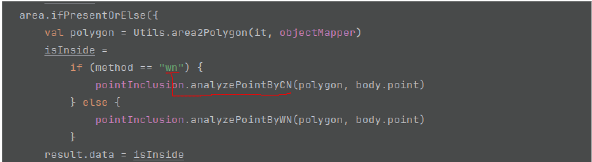

# Resumen manejo de deuda técnica APIPromo

Este documento describe el progreso del manejo de deuda técnica del proyecto APIPromo, a fecha del 25/03/2023 y
representa
una entrega parcial del proyecto

## Estado inicial

Primero es importante recordar el estado inicial del proyecto, si bien el análisis completo se encuentra
en [Etapa1-estado-inicial.md](Etapa1-estado-inicial.md)
en general podemos decir que el proyecto inicialmente contaba con deuda técnica de distintos tipos: de documentación, de
pruebas y de código

Para ejemplificar el estado inicial del proyecto se realizó un análisis de sonarCloud en una de las etapas tempranas en
donde solo se habían eliminado las clases y los métodos sin usos, los resultados se presentan a continuación:

Al analizar los resultados de sonarcloud se evidencia la ausencia de pruebas, y la presencia de algunos code smells, sin
embargo
este análisis no representa el estado del proyecto, puesto que omite aspectos tales como la arquitectura del código y
bugs en la lógica.

Tal y como se encontró en [Etapa3-testing-debt.md](Etapa3-testing-debt.md) algunos métodos que son cruciales en los
distintos módulos
no cumplían ni con los casos de prueba más simples. Otro ejemplo de bug no detectado por la herramienta se muestra en la
siguiente imagen:

Así como casos en los que el código repetido no fue reportado en el análisis:

Finalmente otros aspectos que no se tienen en cuenta por este análisis es el cumplimiento de estándares de código limpio
como YAGNI,KISS y SOLID, el análisis del proyecto con respecto a estos principios se encuentra
en [Etapa2-clean-code-y-XP.md](Etapa2-clean-code-y-XP.md)

## Estado actual

Para ejemplificar el estado actual del proyecto se presenta el siguiente análisis de sonarCloud:

En esta análisis se evidencia la reducción de code smells y el aumento en la cobertura de las pruebas. Aparte de las
mejoras
evidenciadas en el análisis de sonarCloud a continuación se presenta el estado de
las [mejoras propuestas](Etapa1-estado-inicial.md#propuestas-de-refactorización)
a nivel de código durante el análisis inicial

| Propuesta                                                                                                     | Estado                                    |
|---------------------------------------------------------------------------------------------------------------|-------------------------------------------|
| Reorganizar la estructura de archivos del proyecto                                                            | DONE :white_check_mark:                   |
| Incluir servicios con las responsabilidades de llamar a los repositorios y administrar los objetos de dominio | DONE :white_check_mark:                   |
| Refactorizar los métodos                                                                                      | Partially :eyes:                          |
| Obtener los DTOs desde clases autogeneradas a partir del swagger                                              | NOT STARTED :negative_squared_cross_mark: |
| Separar las entidades de repositorio de los DTOs y de los objetos de dominio                                  | DONE :white_check_mark:                   |
| Usar únicamente archivos .kt y utilizar los estándares de codificación de Kotlin                              | DONE :white_check_mark:                   |
| Actualizar las librerías y las versiones de Java y Kotlin                                                     | DONE :white_check_mark:                   |

A la realización de estas propuestas se suman ajustes tales como :

* Migración a gradle por conveniencia de experiencia y así solucionar el problema al construir el proyecto con maven
* Creación de docker-compose con base de datos mysql para facilitar la ejecución local
* Uso de patrón estrategia para evitar revisiones sobre el tipo de algoritmo (CN/WN .. potencialmente otros) en distintas 
  partes del código
* Refactorización sobre la arquitectura del código para tener más lógica en los objetos de dominio y menos en los
  servicios y controladores,
  se intenta llevar un modelo de arquitectura hexagonal
* Adición de herramienta Ktlinformat para asegurar y facilitar el cumplimiento de estilo del código con respecto a los
  estándares de Kotlin

Propuestas de mejora adicionales:

* Reestructurar la funcionalidad de user location , puesto que la implementación actual no es escalable, y no
  permite tener un código limpio

Con respecto al avance de la deuda técnica de pruebas se tienen los siguientes avances con respecto a
lo [propuesto anteriormente](Etapa3-testing-debt.md#estrategia-para-reducir-deuda-técnica-de-pruebas)

| Propuesta     | Estado                                    |
|---------------|-------------------------------------------|
| Modulo core   | DONE :white_check_mark:                   |
| Modulo areas  | Partially :eyes:                          |
| Modulo users  | NOT STARTED :negative_squared_cross_mark: |
| Modulo promos | NOT STARTED :negative_squared_cross_mark: |

Propuestas de mejora adicionales:
* Adicionar pruebas de integración en los principales flujos

## Conclusiones
Si bien no se refleja un avance considerable al analizar la diferencia entre los análisis de sonarCloud, se considera
que hay avances importantes en la estructura del código, lo que permitió identificar y arreglar algunos bugs presentes en la 
lógica de domino, adicionalmente los ajustes en la estructura facilitan la creación de futuras pruebas y la manipulación
del código en general.

