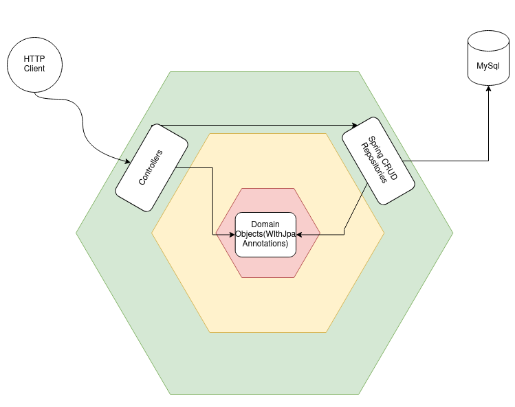
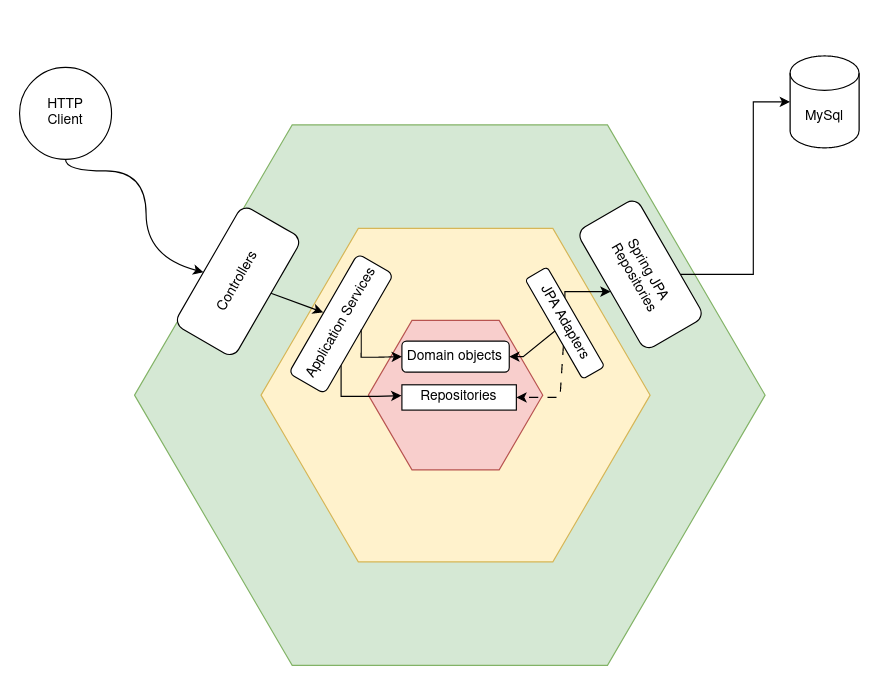
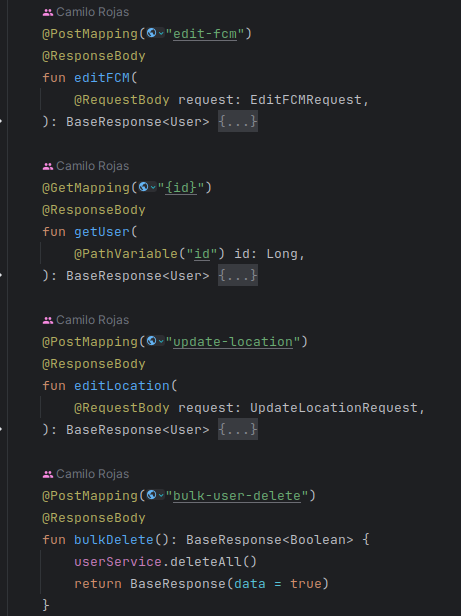
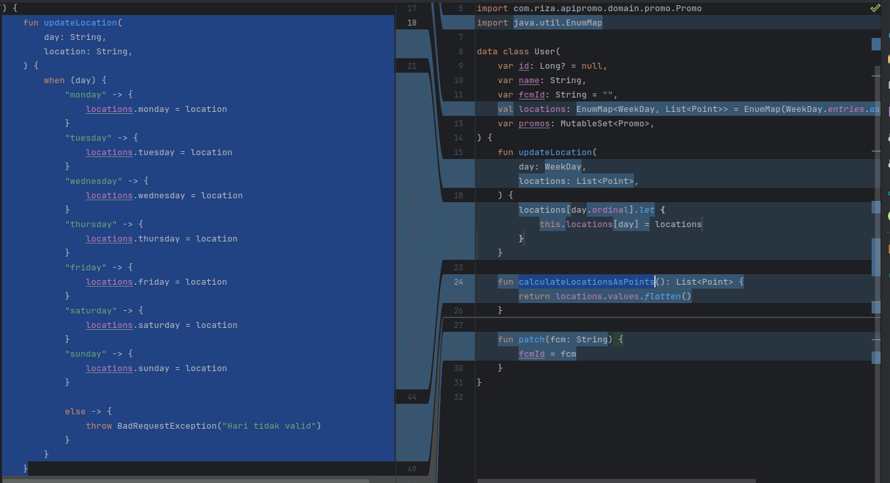
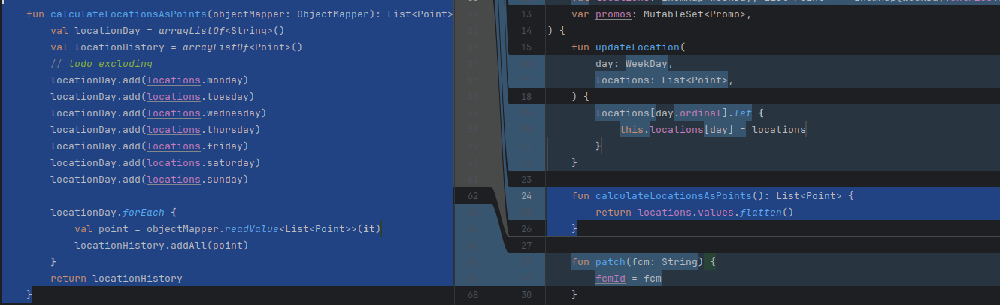

# Deuda técnica de arquitectura
A nivel de deuda ténica de arquitectura se identificaron 3 tipos de deuda dentro del proyecto: 

* Deuda en la arquitectura de los componentes internos
* Deuda en el diseño de la arquitectura de la API REST
* Deuda en el diseño del caso de uso de UserLocations

A continuación se describe cada tipo de deuda identificada, las consecuencias de cada una de ellas y se presentan los ajustes realizados
junto con propuestas de mejora de los componentes que no fueron modificados

## Deuda en la arquitectura de los componentes internos
La arquitectura inicial del proyecto presentaba un diseño de componentes que dificultaba la mantenibilidad y extensibilidad del proyecto,
por ejemplo, la definición de lógica de negocio dentro de los controladores y la falta de una capa de servicios que permita separar
la lógica de negocio de la lógica de controladores, así como una integración directa entre la capa de controladores y la capa de acceso 
a datos.
Adicionalmente se indentificó que los objetos de domino estaban acoplados a la implementación específica de JPA.

A continuación se presenta un diagrama de la arquitectura inicial del proyecto:

Para resolver esta deuda se realizó una refactorización del proyecto para implementar una arquitectura hexagonal limpia, en la que se
separan las capas de controladores, servicios y acceso a datos. Adicionalmente se implementó un mapeo de los objetos de dominio a objetos
de transferencia de datos (DTO) para evitar el acoplamiento de los objetos de dominio a la implementación de JPA. La lógica de negocio 
fue movida a los objetos de dominio y a los servicios, de esta forma los controladores solo se encargan de recibir las peticiones y
enviar las respuestas.

A continuación se presenta un diagrama de la arquitectura actual del proyecto:

## Deuda en el diseño de la arquitectura de la API REST
La arquitectura inicial de la API REST presentaba un diseño que no seguía el modelo de madurez de Richardson, por ejemplo, 
se utiliza el verbo POST para realizar operaciones de modificacion y eliminación, el nombramiento de los endpoints no corresponde
a los recursos que se están manipulando.

A continuación se muestra evidencia de los poblemas de diseño de la arquitectura de la API REST original:

Para resolver esta deuda se realizó una refactorización de los endpoints de la API REST para que sigan el modelo de madurez de Richardson, 
hasta un nivel de madurez 2, donde se utilizan los verbos HTTP de forma correcta y se nombran los endpoints de forma adecuada, para 
representar de mejor manera las operaciones realizadas sobre los recursos.

A continuación se presenta una tabla con la refactorización realizada a los endpoints de la aplicación:

| File               | Old Endpoint              | Old HTTP Verb | New Endpoint                        | New HTTP Verb | OperationName              |
|--------------------|---------------------------|---------------|-------------------------------------|---------------|----------------------------|
| UserController.kt  | `/users/add`              | POST          | `/users`                            | POST          | createUser                 |
| UserController.kt  | `/users/all`              | GET           | `/users`                            | GET           | getAllUsers                |
| UserController.kt  | `/users/edit-fcm`         | POST          | `/users/{userId}`                   | PATCH         | patchUser                  |
| UserController.kt  | `/users/{userId}`         | GET           | `/users/{userId}`                   | GET           | getUserById                |
| UserController.kt  | `/users/update-location`  | POST          | `/users/{userId}/locations/{day}`   | PUT           | editLocationByDayAndUserId |
| UserController.kt  | `/users/bulk-user-create` | POST          | `/users`                            | DELETE        | deleteAllUsers             |
| PromoController.kt | `/promo/add`              | POST          | `/promos`                           | POST          | createPromo                |
| PromoController.kt | `/promo/all`              | GET           | `/promos`                           | GET           | getAllPromos               |
| AreaController.kt  | `/area/add`               | POST          | `/areas`                            | POST          | createArea                 |
| AreaController.kt  | `/area/all`               | GET           | `/areas`                            | GET           | getAllAreas                |
| AreaController.kt  | `/area/delete`            | POST          | `/areas/{id}`                       | DELETE        | deleteAreaById             |
| AreaController.kt  | `/area/check/{method}`    | POST          | `/areas/{areaId}/check/{method}`    | POST          | checkPointInArea           |
| AreaController.kt  | `/area/checkAll/{method}` | POST          | `/areas/{areaId}/checkall/{method}` | POST          | checkAllPointsInArea       |

## Deuda en el diseño del caso de uso de UserLocations
El diseño de esta funcionalidad se relaciona a almacenar la ubicación de un usuario, de forma que luego se pueda validad cuando
un usuario se encuentra en una determinada área. La implementación actual esta limitada a almacenar la ubicación de un usuario
en los distintos días de la semana, por lo que no es posible almacenar la ubicación para más de una semana. 

Este problema de diseño limita la extensibilidad de la aplicación ya que, si se deseara crear promociones que tengan en
cuenta la ubicación de un usuario en los ultimos 15 días, no sería posible.

Cómo propuesta de mejora se plantea la creación de una tabla de ubicaciones que permita almacenar la ubicación de un usuario
asociada a una fecha, de forma que se pueda almacenar la ubicación de un usuario en cualquier fecha y no solo en los días de la semana.

Si bien este ajuste no fue implementado, se propone como una mejora futura a la aplicación, en caso que 
las necesidades del negocio demanden otro tipo de funcionalidades.

Dado que no se realizó el cambio de enfoque de UserLocation, se realizó una refactorización para facilitar el manejo de
las localizaciones dentro del proyecto, se pasa de crear una columna por cada dia de la semana y de tener un objeto 
con un atributo por cada día a usar un EnumMap y un Enum para manejar los días de la semana, en la base de datos se almacena
como una sola columna con el JSON del mapa utilizado, esto reduce la complejidad del código y facilita la manipulación segura
de dichas localizaciones.

La reducción de complejidad de evidencia en los métodos de updateLocation y calculateLocationsAsPoints, tal y como se muestra
a continuación:

